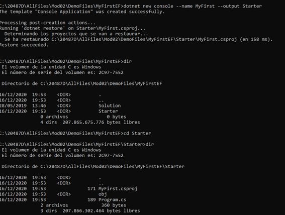

# 20487D_MOD02_DEMO_L4_UsingEFWithIn-MemoryDatabase

JOSE VICENTE TEJERO - 17/12/2020

RESUMEN
Using Entity Framework with In-Memory Database

PROBLEMAS
No

**Lesson 2: Creating an Entity Data Model**

**Demonstration: Creating an Entity Type, DbContext, and DbInitializer**

 

****

 

****

****

 

 

# Lesson 3: Querying Data

### Demonstration: Using Language-Integrated Query (LINQ) to Entities

 

 

 

Demonstration 2: Running Stored Procedures with Entity Framework

 

 

 

\# Lesson 4: Manipulating Data

\### Demonstration: CRUD Operations in Entity Framework

 

 

 

**Demonstration: Using Entity Framework with In-Memory Database**

 

 

 

 

El resultado es el siguiente:

 

 

### Demonstration: Using Entity Framework with SQLite

 

Resultado:

 

 

 

 

 
